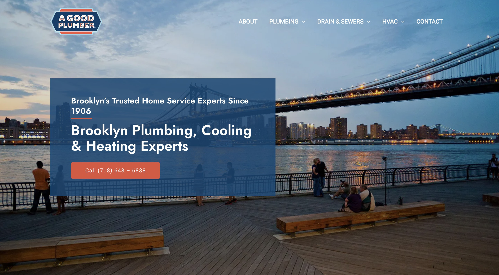

  

<h1 align="center">Hi, I'm Hashim Nadeem</h1>
<h3 align="center">A web developer from Brooklyn, New York</h3>
<h4 align="center">Hello there! My name is Hashim Nadeem. I am a web developer with based out of NYC with good knowledge in creating websites and emails. My capabilities include converting designs into responsive emails and websites, ensuring a good experience for all users. Besides web development, I am also into sports, movies, video games, and do some traveling from time to time.</h4>

<!-- TECHS -->

<h2 align="center">Skills</h2>

                 
                    
  
                       
			
                      
                      
		      
			
                      

 

<!-- PROJECTS -->

<h2 align="center">Projects</h2>

	<table>
		<tr>
			<td width="50%">
				<h3 align="center">The Good Plumbers Website</h3>
				
  
					
					 
					 
					
 
						
					

					
<strong>WordPress</strong>

          

						This is a website built with WordPress CMS
					

				

			</td>
			<td width="50%">
				<h3 align="center">Bookmark Landing Page</h3>
				
  
					
					 
					 
					

						  
							
					

					 
<strong>HTML, CSS, Javascript</strong>

					
This is a landing page created for Bookmark

				

        </tr>
	    <tr>
            <td width="50%">
                <h3 align="center">Easybank Landing Page</h3>
                
  
                    
                     
                     
                    

                          
						
                    

                    
<strong>HTML, CSS, Javascript</strong>

		    
This is a landing page for Easybank

                

            </td>
            <td width="50%">
                <h3 align="center">Room Landing Page</h3>
                
  
                    
                     
                     
                    

                          
							
                    

                    
<strong>HTML, CSS, Javascript</strong>

		    
This a landing page for a room furniture website

                
	
            </td>
        </tr>
	<tr>
			<td width="50%">
				<h3 align="center">Duluth Trading Co. Promotional Email</h3>
				
  
					
					 
					 
					

						  
						
					

					
<strong>HTML, CSS</strong>

          

						This is a responsive, HTML email for Duluth Trading Co.
					

				

			</td>
			<td width="50%">
				<h3 align="center">Chipotle Transactional Email </h3>
				
  
					
					 
					 
					

						  
							
					

					 
<strong>HTML, CSS</strong>

					
This is a responsive, transactional email for Chipotle

				

        </tr>
	<tr>
			<td width="50%">
				<h3 align="center">Tripadvsior Newsletter Email</h3>
				
  
					
					 
					 
					

						  
						
					

					
<strong>HTML, CSS</strong>

          

						This is a responsive, newsletter HTML email for Tripadvsior
					

				

			</td>
			<td width="50%">
				<h3 align="center">Clothes Castle </h3>
				
  
					
					 
					 
					
 
							
					

					 
<strong>Shopify</strong>

					
This is an e-commerce clothing store website

				

        </tr>
	</table>

 
 

<!-- SOCIALS -->

<h2 align="center">Contact Me</h2>

	&nbsp&nbsp&nbsp
	&nbsp&nbsp&nbsp
&nbsp&nbsp&nbsp
&nbsp&nbsp&nbsp

